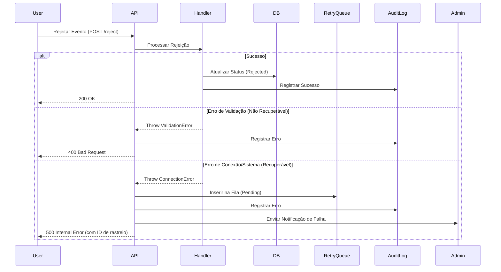

# Tratamento de Erros e Rejeição de Eventos

Este documento descreve a arquitetura de tratamento de erros para o sistema de gestão de eventos de máquinas, com foco na rejeição de eventos e mecanismos de recuperação.

## 1. Visão Geral

O sistema implementa uma abordagem robusta para capturar, registrar e recuperar-se de falhas durante o processamento de eventos (especificamente rejeição e aprovação).

### Componentes Chave:
- **Middleware de Erro (`lib/error-handling`)**: Centraliza a lógica de captura e decisão.
- **Fila de Retentativa (`event_retry_queue`)**: Tabela no banco de dados para persistência de falhas recuperáveis.
- **Log de Auditoria (`audit_logs`)**: Registro imutável de todas as tentativas e erros.
- **Notificações**: Alertas para administradores em caso de falhas críticas.

## 2. Fluxo de Tratamento de Erros (Sequence Diagram)

## 3. Códigos de Erro

| Código | Descrição | Status HTTP | Recuperável? | Ação Recomendada |
|--------|-----------|-------------|--------------|------------------|
| `VALIDATION_ERROR` | Dados inválidos ou incompletos (ex: falta motivo). | 400 | Não | Corrigir dados e tentar novamente manualmente. |
| `PERMISSION_ERROR` | Usuário sem permissão ou estado do evento inválido. | 403 | Não | Verificar permissões do usuário. |
| `CONNECTION_ERROR` | Falha ao conectar com banco ou serviços externos. | 503 | Sim | O sistema tentará automaticamente via fila. |
| `UNEXPECTED_ERROR` | Erro não tratado (bug ou exceção desconhecida). | 500 | Sim | Investigar logs e hotfix. |

## 4. Políticas de Retentativa

Eventos marcados como recuperáveis (`isRetryable: true`) são inseridos na tabela `event_retry_queue` com os seguintes parâmetros:

- **Máximo de Tentativas**: 3
- **Estratégia de Backoff**: Exponencial (planejado) ou intervalo fixo (atualmente manual/cron).
- **Processamento**: Um job agendado (cron) deve ler itens com status `pending` e tentar reprocessar.

### Estrutura da Fila (`event_retry_queue`)
- `event_id`: ID do evento original.
- `error_details`: JSON com stack trace e metadados.
- `retry_count`: Número de tentativas já realizadas.
- `status`: `pending`, `processing`, `retried`, `failed`.

## 5. Protocolos de Recuperação

### Falha Automática
1. O sistema detecta erro recuperável.
2. Registra na fila.
3. Notifica admins.
4. (Futuro) Job automático tenta reprocessar.

### Intervenção Manual
Caso o número máximo de retentativas seja excedido (`status: failed`):
1. O administrador recebe um alerta crítico.
2. Deve acessar o painel de auditoria/logs.
3. Analisar o `error_details`.
4. Pode forçar uma nova tentativa ou marcar como resolvido manualmente.

## 6. Testes

Os testes cobrem:
- **Unitários**: Validação da lógica de decisão (`isRetryable`) e formatação de resposta.
- **Integração**: Fluxo completo da API simulando erros de banco de dados e validação.

Localização dos testes: `app/events/__tests__/rejection.test.ts`
